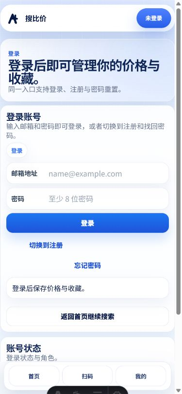
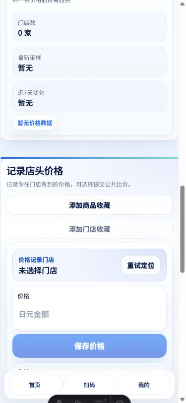
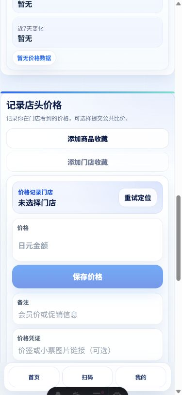
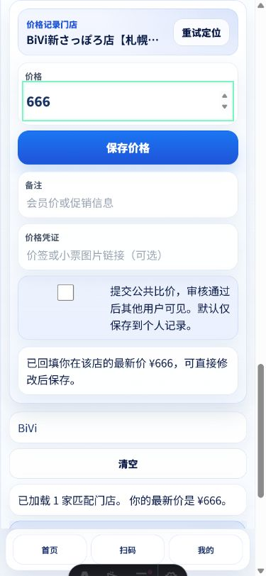

# 登录与店头价格输入体验审计

审计日期：2026-07-27  
环境：本地生产构建，移动端视口  
范围：登录 → 打开商品 → GPS 选店 → 定位失败兜底 → 手动选店 → 修改价格（未提交）

## 结论

登录已恢复为可完成状态，Turnstile 没有额外打断用户。价格输入本身清楚，但“记录价格”卡片同时承载收藏、定位、备注、凭证、公开提交和门店搜索，主任务被稀释。最值得先做的是把首屏收敛为：

1. 最近门店
2. 价格
3. 保存

收藏、备注、凭证与公共比价放入“更多选项”；定位失败时，在门店字段内直接显示原因和手动搜索入口。

## 流程截图与健康度

### 1. 登录页 — 健康

- 邮箱、密码和主按钮的顺序符合预期。
- 本次登录一次成功，没有出现可见 Turnstile 挑战，也没有控制台错误。
- 页面同时出现“登录”“登录账号”“账号状态”等重复层级，可再压缩。
- 人机验证只应在加载失败或需要用户处理时出现；正常透明通过时无需占据视觉注意力。

### 2. 登录成功后的首页 — 健康

- 登录后正常进入首页，扫码是明确的主操作。
- 首页操作密度低，适合作为价格记录流程的入口。

### 3. 进入价格记录并尝试 GPS — 需改进

- 自动选最近门店的意图正确，但定位不可用时只显示“重试定位”，用户看不到失败原因。
- 跳转后表单没有贴近视口顶部，上方仍露出上一段“价格洞察”，削弱任务聚焦。
- 两个收藏按钮先于门店和价格出现，打断“选店 → 输价 → 保存”的主路径。

### 4. GPS 重试失败 — 需优先修复体验

- 实际状态为“定位失败，门店已按名称排序”，但错误提示位于页面其他区域，不在触发定位的控件附近。
- 建议在门店卡片内直接显示：“无法获取位置，请允许定位或手动搜索门店”，并提供两个紧邻操作。
- 需要区分权限拒绝、超时、浏览器不支持和附近无坐标门店，避免统一显示“重试定位”。

### 5. 手动选择门店 — 可用但信息层级偏重

- 搜索 `BiVi` 后可以选择唯一匹配门店，价格自动回填，保存按钮可用。
- 已选门店名称被截断，缺少距离和地址确认信息；GPS 默认选店时会降低信任。
- 门店搜索结果位于表单下方。定位失败后，用户必须继续向下找，兜底入口不够就近。
- 自动回填历史价格有误保存风险。应明确标记“上次记录 ¥666”，或默认留空并提供一键采用历史价。

### 6. 修改价格 — 输入可用，外围选项过多

- 数字键盘型输入、明显焦点态和全宽保存按钮都很好。
- 核心输入只需要一个价格，但首屏同时展示收藏、备注、凭证和公开比价，增加决策成本。
- “价格凭证”要求粘贴图片链接，对普通顾客不自然；如果暂不做上传，建议折叠到更多选项。
- 公共比价默认不勾选是正确的，应保留为次要选项。

## 修改建议

### P0：把主流程压缩成一个三步卡片

默认只展示：

1. **门店**：自动定位成功后显示“最近门店 · 0.4 km”，附“更换”
2. **价格**：数字输入，货币单位常驻
3. **保存价格**：主按钮

把“收藏商品、收藏门店、备注、价格凭证、提交公共比价”放进一个默认收起的“更多选项”。这不需要新增页面，也不需要引入新组件库。

### P0：把定位状态放回门店字段

- 定位中：`正在查找最近门店…`
- 成功：`已选择最近门店 · 0.4 km`，显示完整门店名与地区
- 权限拒绝：`无法获取位置` + `允许定位` / `搜索门店`
- 超时或不可用：`定位暂不可用` + `重试` / `搜索门店`
- 附近无坐标门店：`附近暂无线下门店数据` + `按名称搜索`

提示区域使用 `aria-live`，定位按钮通过 `aria-describedby` 关联状态。

### P1：定位失败后直接打开手动搜索

门店搜索应放在门店卡片内部，或以轻量弹层出现。失败后自动聚焦搜索框；匹配结果显示：

- 门店名
- 地区/地址
- 距离（有定位时）

选择后回到价格输入并自动聚焦，不需要用户继续滚动。

### P1：避免历史价格被误当成新价格

当前会直接回填 `¥666`。更安全的两种方式：

- 推荐：输入框保持为空，下方显示“上次记录 ¥666 · 使用此价格”
- 若继续回填：把按钮改成“更新为 ¥777”，并在输入旁明确显示“已从上次记录回填”

### P1：修正进入表单后的滚动位置

从“记录价格”入口进入时，让“记录店头价格”标题贴近视口顶部；完成选店后聚焦价格框。不要停在上一段内容和表单之间。

### P2：进一步压缩登录页

保留一个标题、一句辅助文案、邮箱、密码、登录按钮。注册与忘记密码作为次要链接；“账号状态”仅在已登录或发生错误时展示。

## 保留的优点

- Turnstile 在本次生产构建中未阻断正常登录。
- 价格字段有可见标签、数字输入和清楚的焦点态。
- 保存按钮在有效状态下非常明确。
- 公共分享默认关闭，符合隐私预期。
- 手动门店搜索可用，已具备 GPS 失败时的基础兜底能力。

## 证据限制

- 审计浏览器无法授予真实 GPS 权限，因此验证了“定位失败与手动兜底”，没有验证真实坐标下的最近门店距离排序。
- 未提交价格，避免写入测试账号数据。
- 本次是移动端视觉与交互审计，不是完整 WCAG、屏幕阅读器或跨浏览器认证。
- 截图中的 `02-login-blocked.png` 文件名沿用采集时命名，实际内容是登录成功后的首页。

